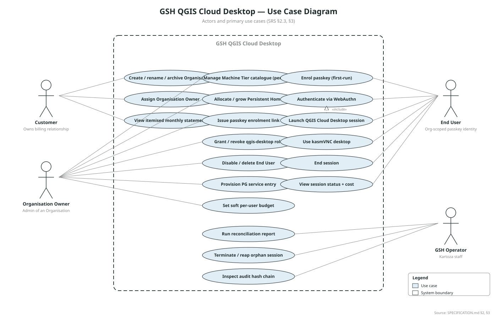
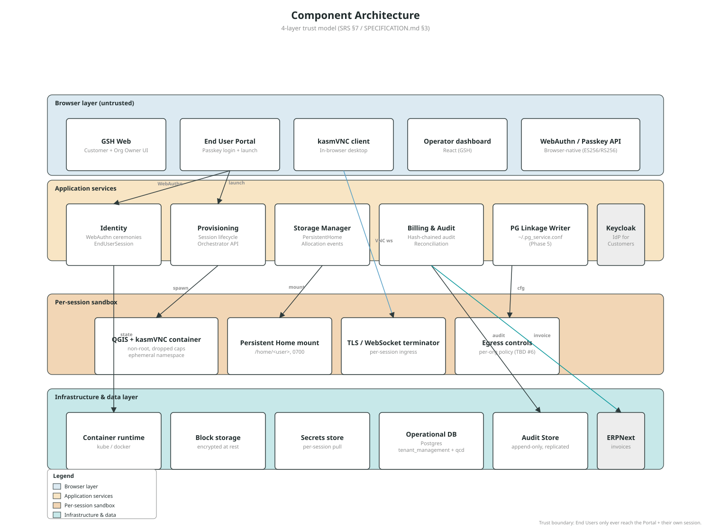
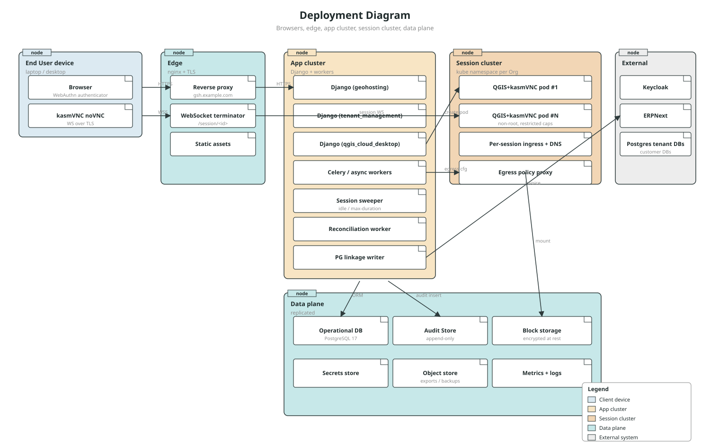
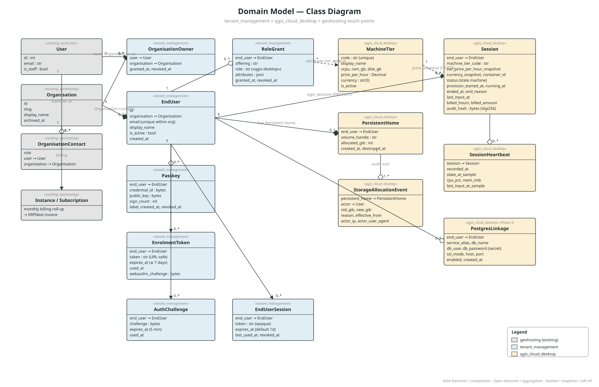
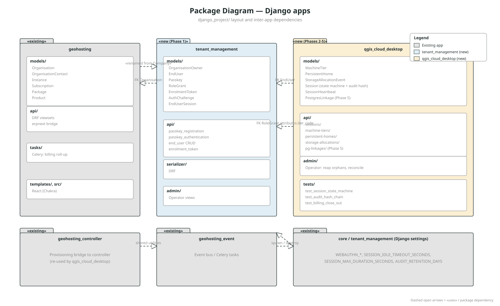
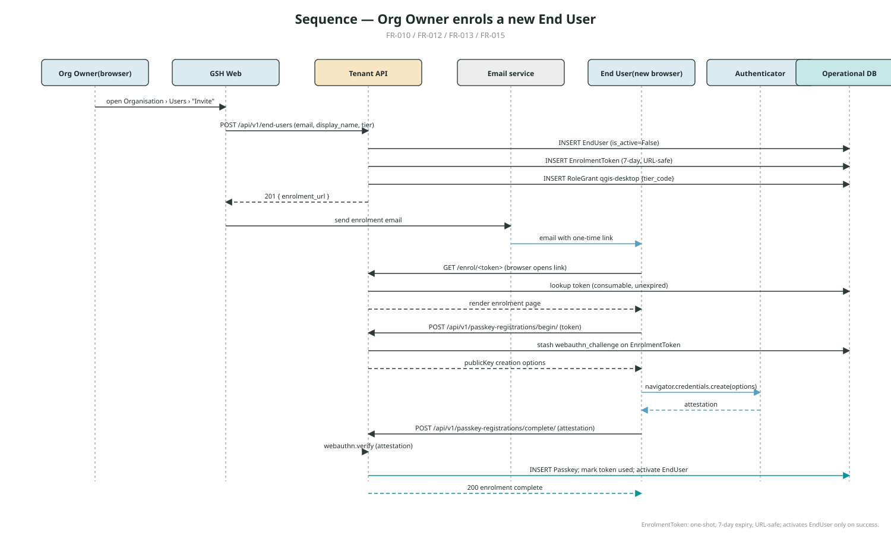
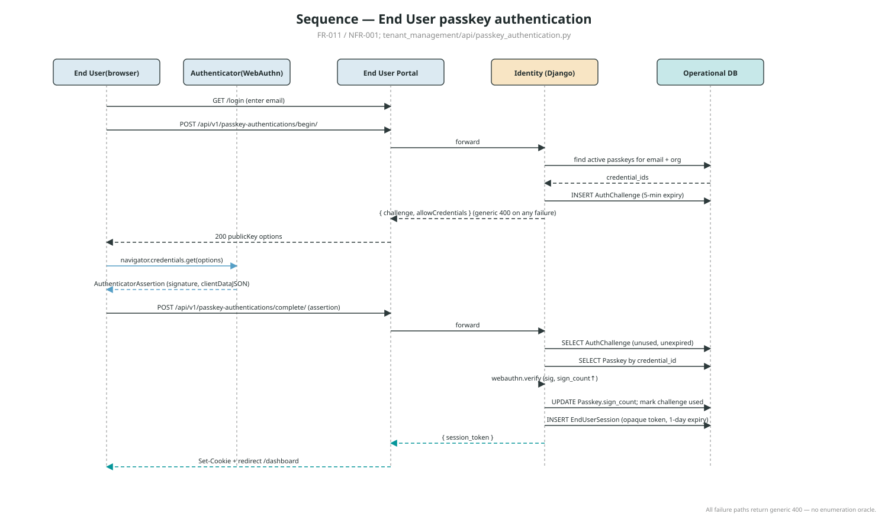
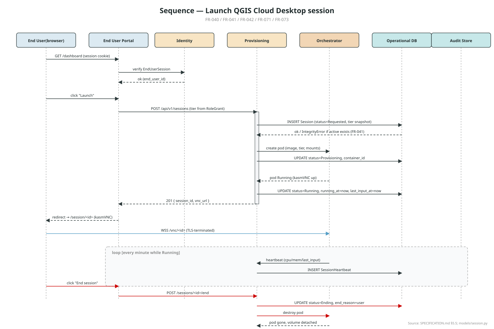
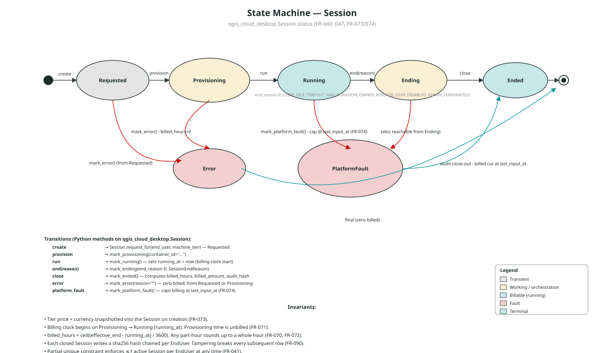
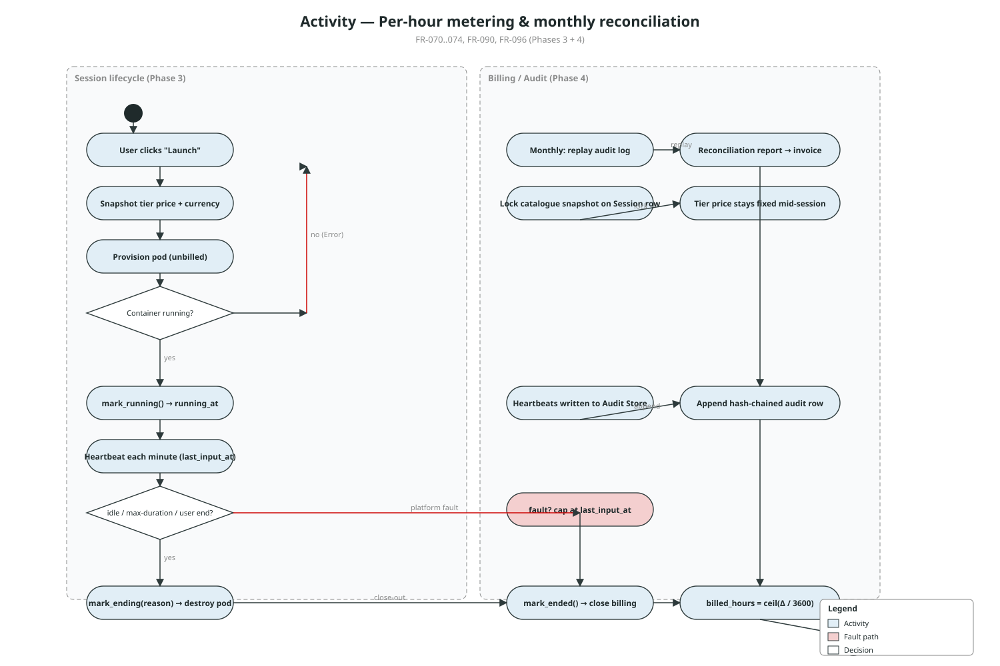

# GSH QGIS Cloud Desktop — System Architecture

A consolidated technical view of the GSH QGIS Cloud Desktop offering. This
document is the narrative companion to the UML diagram set in
[`diagrams/`](diagrams/index.md). It is intended to be read from top
to bottom: each section embeds the relevant diagram(s) and explains them
in prose, with cross-references to the canonical SRS at
[`srs/v0.3/`](srs/v0.3/index.md) and the living traceability table in
[`specification.md`](specification.md).

> **Rule of precedence**
> The SRS PDF wins on *intent* (what we agreed to build). `specification.md`
> wins on *current state* (what is actually built). This document is the
> *architectural treatment* — it explains the structure that makes those
> requirements satisfiable. When the architecture changes, update this
> file in the same commit.

| Field | Value |
| --- | --- |
| Source SRS | `srs/v0.3/GSH_QGIS_Cloud_Desktop_SRS_v0.3.pdf` (v0.3 — Draft, May 2026) |
| Last sync | 2026-06-06 |
| Tracking epic | [kartoza/GeoHosting#763](https://github.com/kartoza/GeoHosting/issues/763) |
| Diagram set | [`diagrams/`](diagrams/index.md) |
| Living spec | [`specification.md`](specification.md) |

---

## Table of contents

1. [Product summary](#1-product-summary)
2. [Personas, actors and use cases](#2-personas-actors-and-use-cases)
3. [Architecture overview](#3-architecture-overview)
   - [3.1 Layered component view](#31-layered-component-view)
   - [3.2 Physical deployment](#32-physical-deployment)
4. [Domain model](#4-domain-model)
   - [4.1 Domain class diagram](#41-domain-class-diagram)
   - [4.2 Django package structure](#42-django-package-structure)
5. [End-to-end flows](#5-end-to-end-flows)
   - [5.1 End User enrolment](#51-end-user-enrolment)
   - [5.2 Passkey authentication](#52-passkey-authentication)
   - [5.3 Launching a QGIS Cloud Desktop session](#53-launching-a-qgis-cloud-desktop-session)
6. [Lifecycle, billing and audit](#6-lifecycle-billing-and-audit)
   - [6.1 Session state machine](#61-session-state-machine)
   - [6.2 Per-hour metering and monthly reconciliation](#62-per-hour-metering-and-monthly-reconciliation)
7. [Non-functional summary](#7-non-functional-summary)
8. [Open architectural questions](#8-open-architectural-questions)
9. [Diagram index and re-generation](#9-diagram-index-and-re-generation)

---

## 1. Product summary

GSH QGIS Cloud Desktop is a per-hour-billed, containerised QGIS desktop
delivered to End Users in the browser via **kasmVNC**. It introduces two
cross-cutting capabilities that GeoSpatialHosting (GSH) does not yet have:

1. **Organisation-scoped end-user management** — Customers manage their
   own passkey-authenticated End Users inside Organisations they own.
2. **Hybrid billing** — per-hour metered compute (Machine Tiers) combined
   with per-month pro-rated Persistent Home storage, with a defensible
   append-only audit log behind every billable event.

See SRS §1–§2 for full purpose and scope. The architectural challenge is
that *every* billable event must be reconstructable from an append-only
audit log so that customer disputes can be settled against an immutable
record — the rest of this document is about how the components and
collaborations satisfy that constraint.

---

## 2. Personas, actors and use cases

Four personas interact with the platform:

| Persona | Source | Role |
| --- | --- | --- |
| **Customer** | Existing GSH account holder | Owns the billing relationship; owns one or more Organisations. |
| **Organisation Owner** | New | Administers an Organisation: creates End Users, assigns roles, sets tiers, allocates storage, links Postgres, consumes billing. |
| **End User** | New | Org-scoped passkey identity. Launches and uses a single QGIS Cloud Desktop session at a time. |
| **GSH Platform Operator** | Existing (Kartoza staff) | Operates the platform, reconciles disputed bills, intervenes in stuck sessions. |

The use-case view ties each persona to the use cases they trigger. Note
that "Launch QGIS Cloud Desktop session" `«include»`s "Authenticate via
WebAuthn" — there is no path that lets an End User reach the compute
plane without a fresh passkey assertion.



**Reading notes**

- The system boundary (dashed rectangle) encloses every use case. Outside
  the boundary, actors only interact through their respective UIs (GSH
  Web for Customer + Org Owner, End User Portal for End User, Operator
  dashboard for Kartoza staff).
- Billing-relevant use cases (the Customer's "View itemised monthly
  statement" and the Operator's "Run reconciliation report") share a
  common audit source — there is no separate "billing database" the two
  could disagree on.

Source: `specification.md` §2, §3.

---

## 3. Architecture overview

### 3.1 Layered component view

The system is structured as **four trust layers** (SRS §7). Higher layers
are progressively more trusted, and the boundaries between them are the
places where authentication, authorisation, encryption and isolation are
enforced.



**Layer-by-layer**

- **Browser layer (untrusted)** — The End User's browser is treated as
  hostile. The only things that ever reach it are the End User Portal,
  the kasmVNC client, and WebAuthn API calls. The browser never sees
  service credentials, database connection strings, or audit data
  belonging to other tenants.
- **Application services** — Stateless Django services. *Identity*
  handles the WebAuthn ceremonies and issues opaque `EndUserSession`
  tokens. *Provisioning* drives the per-session state machine.
  *Storage Manager* owns `PersistentHome` allocations. *Billing & Audit*
  is the only writer to the append-only Audit Store. *PG Linkage Writer*
  is the only component that touches the container's
  `~/.pg_service.conf` (Phase 5). *Keycloak* remains the IdP for
  Customers (not End Users).
- **Per-session sandbox** — One ephemeral QGIS+kasmVNC container per
  active session. Runs as non-root with dropped capabilities and an
  ephemeral host namespace. The Persistent Home is bind-mounted at
  `/home/<user>` with mode 0700. Egress policy is enforced at the
  container's network boundary; the container has no credentials for
  any GSH back-end.
- **Infrastructure & data layer** — Container runtime (kube/docker),
  encrypted block storage, secrets store, operational Postgres,
  replicated append-only Audit Store, and ERPNext for invoice line
  ingestion.

**Trust boundary invariants**

1. End Users never reach the application-services layer except via the
   End User Portal and their own session's kasmVNC WebSocket.
2. The per-session sandbox has *zero* outbound credentials to any GSH
   back-end. The Provisioning service pushes anything the container
   needs at start time (most notably the `pg_service.conf` content).
3. The Audit Store is write-only from application services and
   read-only from reconciliation/operator tooling.

### 3.2 Physical deployment

The deployment view maps the logical layers onto physical nodes. There
are deliberately *two* compute clusters — an **App cluster** (long-lived
Django + workers) and a **Session cluster** (short-lived QGIS pods, one
per active session) — so that load on the user-facing services scales
independently of the size of the session fleet.



**Notes**

- *Edge*: a single nginx/TLS terminator handles both HTTPS for the API
  and per-session WSS terminations to the kasmVNC pods. Per-session
  ingresses are created on session start and torn down on session end.
- *Session cluster*: pods are deployed into a kube namespace per
  Organisation, which makes the cross-organisation isolation NFR
  (NFR-005) enforceable at the cluster level rather than only at the
  app layer.
- *Data plane*: the Audit Store is logically separate from the
  Operational DB (NFR-094 — storage independent of operational DB).
  Replication is required so that a single-node loss does not lose
  audit data (NFR-022).
- *External*: Keycloak remains the IdP for Customers. ERPNext receives
  monthly invoice lines from Billing & Audit; per-Org Postgres tenant
  databases are referenced by `PostgresLinkage` rows but managed
  outside this offering.

---

## 4. Domain model

### 4.1 Domain class diagram

The domain spans three Django apps. `geohosting/` provides the existing
billing-bearing tenancy (the `Organisation` model — renamed from
`Company` — `OrganisationContact`, `Instance`, `Subscription`).
`tenant_management/` adds the new passkey-authenticated End User
identity layer. `qgis_cloud_desktop/` adds the offering-specific
catalogue, storage and session lifecycle.



**Key design choices**

- **Customer ≡ existing `auth.User`.** The SRS "Customer" maps directly
  to the existing Django user; we did *not* introduce a separate
  Customer entity (see `specification.md` §"Terminology and naming
  variances").
- **Organisation is the existing model**, just renamed. All Phase 1
  work hangs off it via `OrganisationOwner` (who can administer it)
  and `EndUser` (who lives inside it).
- **EndUser is its own identity.** It has no `auth.User` — End Users
  authenticate only via WebAuthn, and the opaque `EndUserSession` token
  is the bearer credential. This deliberately avoids any password
  fallback (NFR-001).
- **AuthChallenge vs EnrolmentToken.** Two distinct short-lived state
  rows for two different WebAuthn ceremonies — `EnrolmentToken` is the
  7-day, one-shot artefact that lets an End User register their first
  passkey; `AuthChallenge` is the 5-minute server-side state for an
  ongoing authentication assertion.
- **RoleGrant is offering-agnostic.** It has an `offering` string and
  a `role` string plus a free-form `attributes` JSON. The qgis-desktop
  role stores its `tier_code` in `attributes`, which is how a future
  offering can plug in without a schema change (FR-022).
- **Session snapshots the tier.** `tier_price_per_hour_snapshot` and
  `currency_snapshot` are written into the `Session` row when it is
  created. Mid-session catalogue changes can never reach a running
  session (FR-073). This is the architectural mechanism that makes
  per-hour billing defensible.
- **Audit hash chain.** Each closed `Session` carries an `audit_hash`
  that includes the previous closed Session's hash *for the same
  EndUser*. Tampering with any single billing row breaks every
  subsequent row in that End User's history (FR-090). The chain is
  per-EndUser to keep verification scoped and to avoid contention.

### 4.2 Django package structure

The package diagram shows the three apps and the inter-app dependency
arrows.



**Notes**

- `tenant_management` only depends on `geohosting.Organisation` (the
  renamed `Company`). It introduces no FK into `auth.User` for End
  Users — those are a separate identity space.
- `qgis_cloud_desktop` depends on `tenant_management.EndUser` for every
  customer-facing row and on `tenant_management.RoleGrant` for tier
  resolution (the link is intentionally soft: a `tier_code` string, not
  an FK, so seed-data updates to the catalogue can never cascade into
  running sessions — FR-073).
- The existing `geohosting_controller` and `geohosting_event` apps are
  reused by `qgis_cloud_desktop` for spawn/destroy operations and the
  Celery event bus. Phase 6 may add shared utilities back into
  `geohosting/`.

---

## 5. End-to-end flows

The three sequence diagrams cover the lifecycle from "Org Owner invites
a user" through "user gets a working QGIS desktop in their browser."
They are written in execution order — enrolment, then authentication,
then session launch — so each one builds on the artefacts left by the
previous one.

### 5.1 End User enrolment

An Org Owner creates an `EndUser` and emails a one-time enrolment link.
The new End User opens the link in a fresh browser and registers their
first passkey via the WebAuthn registration ceremony. The End User is
only `is_active = True` once the registration completes successfully.



**Architectural points**

- `EnrolmentToken` is **single-use and URL-safe**, with a 7-day expiry.
  The same row holds the `webauthn_challenge` for the registration
  ceremony, so the begin/complete pair binds to the same invite.
- The `RoleGrant` is created *up front* with the tier picked by the Org
  Owner — so by the time the End User authenticates, the platform
  already knows which Machine Tier they are entitled to.
- All API paths under `/api/v1/passkey-registrations/{begin,complete}/`
  are `AllowAny` because the End User cannot yet authenticate. Security
  comes from the token, not the bearer.

Implementing module: `tenant_management/api/passkey_registration.py`.

### 5.2 Passkey authentication

A registered End User logs in by performing the WebAuthn authentication
ceremony. The Identity service issues an opaque `EndUserSession` token
which becomes the bearer credential for the rest of their browser
session.



**Architectural points**

- **No enumeration oracle.** Every failure path returns a generic 400
  — unknown email, inactive user, no active passkeys, wrong assertion,
  used/expired challenge are all indistinguishable from the client.
- **AuthChallenge** is server-side state with a 5-minute expiry; it is
  consumed (`used_at` set) on a successful complete.
- **sign_count is advanced** on every successful verification — a
  replayed assertion will fail the WebAuthn library's monotonic check.
- The `EndUserSession` token is **opaque** (not a JWT) and is bound to
  the `EndUser` server-side, so revoking it (Org Owner disables user)
  is an immediate DB change rather than a cryptographic wait.

Implementing module: `tenant_management/api/passkey_authentication.py`.

### 5.3 Launching a QGIS Cloud Desktop session

This is the headline flow. The authenticated End User clicks **Launch**;
the Provisioning service creates a `Session`, asks the Orchestrator for
a pod, transitions to *Running* when the pod is up, and the browser is
redirected into the kasmVNC client.



**Architectural points**

- **Tier snapshot happens at Session creation** — before the pod is
  even requested — so an Org Owner editing the catalogue mid-launch
  cannot retroactively change the price (FR-073).
- **Billing clock starts on Provisioning → Running.** The `running_at`
  timestamp is the canonical start of billable duration; provisioning
  time is unbilled (FR-071).
- **One active session per EndUser** is enforced by a partial-unique
  database constraint, not just an application check, so a race
  between two parallel "Launch" clicks raises an `IntegrityError`
  rather than creating two billable sessions (FR-041).
- **Heartbeats** are written at least once per minute while the
  session is running, capturing CPU/mem and `last_input_at` — the
  latter is what gets used to *cap* billing on a platform-fault end
  (FR-074, FR-091).
- **End-of-session is audited**: when `mark_ended()` runs, billing
  is closed out, the audit hash is computed (chained to the previous
  closed Session for the same EndUser), and the row is appended to
  the Audit Store.

Implementing module: `qgis_cloud_desktop/models/session.py` (state
machine + audit) and the orchestrator API client (outstanding).

---

## 6. Lifecycle, billing and audit

### 6.1 Session state machine

`qgis_cloud_desktop.Session.status` follows the lifecycle in SRS Figure
3. The state machine is the heart of the billing story — every billing
calculation falls out of which transitions happen and *when*.



**Invariants worth re-stating in prose**

1. **Snapshot at create.** Tier price + currency are written into the
   `Session` row when it is first created. Subsequent catalogue edits
   cannot reach this row.
2. **Billing clock on Running.** `running_at` is the only timestamp
   that matters for the start of billing. Provisioning time is free.
3. **Whole-hour rounding.** `billed_hours = ceil((effective_end -
   running_at) / 3600)`. A 10-minute session is one billed hour; a
   65-minute session is two. This is a *deliberate* commercial choice,
   not a precision artefact (FR-070, FR-072).
4. **Platform-fault cap.** If the pod dies on us, the *effective end*
   for billing is `last_input_at`, not the actual `ended_at`. The
   row is flagged for Operator review (FR-074).
5. **Hash chain per EndUser.** Each closed Session's audit hash
   includes the previous closed Session's hash for the same End User.
   Tampering with one row breaks every subsequent row in that End
   User's billing history (FR-090).
6. **One active session at a time.** Enforced by a partial-unique
   index on `end_user` where `ended_at IS NULL` (FR-041).

The Python method triggers on the diagram match the actual implementation
in `qgis_cloud_desktop/models/session.py` — the diagram is generated from
the same understanding that built the code, and the test suite at
`qgis_cloud_desktop/tests/test_session_state_machine.py` covers the
transitions.

### 6.2 Per-hour metering and monthly reconciliation

Per-session metering (Phase 3) and monthly reconciliation (Phase 4) are
two ends of the same audit log. The activity diagram shows both
swimlanes side by side so it is visible that the reconciliation step is
just *replaying* the audit log, not consulting a separate source of
truth.



**Why the architecture supports a defensible monthly reconciliation**

- Every `Session` row carries the locked tier snapshot and the closed
  billing fields (`billed_hours`, `billed_amount`).
- Every `SessionHeartbeat` row carries a `last_input_at_sample`
  contemporaneous with the running session.
- The hash chain means a single tampered row anywhere in an End User's
  billing history breaks every subsequent row — so a forgery shows up
  during reconciliation as an *un-recomputable* tail rather than a
  silent value change.
- Monthly reconciliation re-derives the invoice strictly from the
  audit log; any drift between the audit-derived invoice and the
  actually-issued invoice is logged and flagged (FR-096, NFR-022).

---

## 7. Non-functional summary

Cross-referenced to `specification.md` §6 (full traceability is there).
This section names the *architectural mechanism* that makes each NFR
satisfiable.

| NFR | Mechanism baked into the architecture |
| --- | --- |
| NFR-001 — passkey-only auth | The `EndUser` identity space has no password field. The auth flow has no "forgot password" branch. |
| NFR-002 — TLS for browser↔container | Edge terminator wraps the kasmVNC WebSocket in WSS; the session-cluster ingress is created per session. |
| NFR-003 — encryption at rest | Persistent Home volumes live on encrypted block storage in the data plane. |
| NFR-004 — secrets only at start-up | The PG Linkage Writer is the *only* component that touches `~/.pg_service.conf` and runs at session start; the container never reads the secrets store directly. |
| NFR-005 — cross-org isolation at the data layer | Kube namespace per Org for sandboxes; Django ORM filters scoped to `organisation` for every query — not enforced only in UI. |
| NFR-006 — container escape mitigations | Non-root user, restricted capabilities, ephemeral host namespace (see Component diagram, sandbox layer). |
| NFR-010 — p95 launch ≤ 60 s | Cluster runs warm; tier snapshot + DB writes are O(few-ms); pod start is the dominant term. |
| NFR-011 — 200 concurrent sessions | App cluster and session cluster scale independently. Heartbeats and audit writes go through a back-pressure-tolerant path. |
| NFR-012 — audit ingestion ≥ 10× peak | Audit Store is the only sink for billing-relevant writes; it is replicated and is on its own write path. |
| NFR-020 — node loss preserves Home | Persistent Home lives in the data plane, not on the compute node. |
| NFR-021 — node loss reported ≤ 30 s | Orchestrator marks the Session via `mark_platform_fault()`; the billing cap protects the customer. |
| NFR-022 — Audit Store replicated | Single-node loss does not lose audit data. |
| NFR-030..032 — observability | Every log/metric line carries `session_id`, `organisation_id`, `end_user_id`. Operator dashboard sits on top of that emission. |
| NFR-040..041 — retention + GDPR | Audit retention ≥ 7 years; personal data deletion leaves pseudonymised identifiers in the audit log. |

---

## 8. Open architectural questions

The following items (from SRS §10.3) have *architectural* implications
and need product decisions before the affected phase commits. Each is
called out where it touches an architectural choice in this document.

| # | Question | Architectural impact |
| --- | --- | --- |
| 1 | Default idle timeout (proposed 30 min) and max session length (proposed 12 h) | Drives the Session sweeper sizing and the wall-clock cost of an idle session. |
| 2 | Currency model — single currency per Customer or per Organisation? | The `currency_snapshot` field on `Session` already supports per-Org; finalising drives the catalogue UI. |
| 3 | Credit check / payment-method-on-file at Organisation level before launch | Adds a precondition to the Launch flow in §5.3. |
| 4 | End User visibility of own sessions / accumulated time | Adds a read-only API surface scoped to `end_user_id`. |
| 5 | Storage tariff structure | Drives the storage billing math in §6.2 and the StorageAllocationEvent close-out. |
| 6 | Container network egress posture | Drives the "Egress controls" component in §3.1 and the per-org egress proxy in §3.2. |

---

## 9. Diagram index and re-generation

| # | Section | File |
| --- | --- | --- |
| 01 | §2 | [`diagrams/01_use_case.svg`](diagrams/01_use_case.svg) |
| 02 | §4.1 | [`diagrams/02_class_domain.svg`](diagrams/02_class_domain.svg) |
| 03 | §3.1 | [`diagrams/03_component_architecture.svg`](diagrams/03_component_architecture.svg) |
| 04 | §3.2 | [`diagrams/04_deployment.svg`](diagrams/04_deployment.svg) |
| 05 | §5.3 | [`diagrams/05_sequence_session_launch.svg`](diagrams/05_sequence_session_launch.svg) |
| 06 | §5.2 | [`diagrams/06_sequence_passkey_auth.svg`](diagrams/06_sequence_passkey_auth.svg) |
| 07 | §5.1 | [`diagrams/07_sequence_enrolment.svg`](diagrams/07_sequence_enrolment.svg) |
| 08 | §6.1 | [`diagrams/08_state_session.svg`](diagrams/08_state_session.svg) |
| 09 | §6.2 | [`diagrams/09_activity_billing.svg`](diagrams/09_activity_billing.svg) |
| 10 | §4.2 | [`diagrams/10_package_django.svg`](diagrams/10_package_django.svg) |

All diagrams are generated from `scripts/generate_uml_diagrams.py` and
use the Kartoza brand palette (highlight1 `#DF9E2F`, highlight2
`#569FC6`, highlight3 `#8A8B8B`, highlight4 `#06969A`, alert `#CC0403`).
Re-run after any change:

```bash
python3 scripts/generate_uml_diagrams.py
```

The SVGs are hand-rolled plain SVG so they edit cleanly in **Inkscape**.
Every shape and connector is grouped (`<g>`) where it logically belongs.

---

Made with 💗 by [Kartoza](https://kartoza.com) ·
[Donate](https://github.com/sponsors/kartoza) ·
[GitHub](https://github.com/kartoza/GeoHosting)
