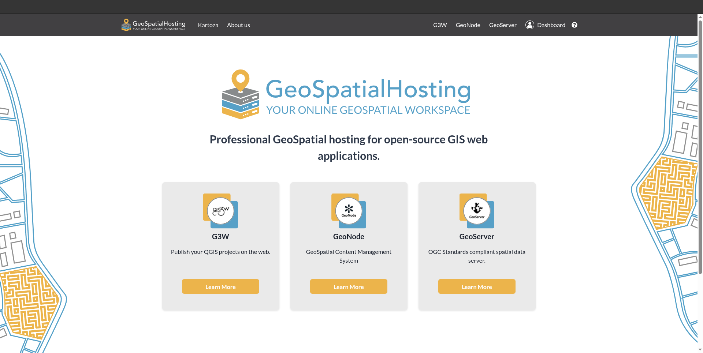

# 🌍 GeoSpatialHosting

**GeoSpatialHosting (GSH)** is an on-demand platform that lets you spin up fully functional GIS tools like [GeoNode](https://geonode.org), [G3W-Suite](https://g3w-suite.readthedocs.io/), and [GeoServer](https://geoserver.org) — instantly.

Whether you're a spatial analyst, developer, NGO, or municipality, GSH removes the complexity of server configuration and lets you focus on your project — not your infrastructure.

<!-- **Launch and manage your open-source GIS stack in minutes.** -->

> The fastest, most reliable way to deploy GeoNode, GeoServer, and G3W-Suite — no DevOps required.

## 🎯 Why GSH?

Deploying open-source GIS tools can be time-consuming, technically complex, and costly to maintain. For smaller GIS teams, launching your own spatial platform with all the overheads can seem impossible.

GSH changes that — putting the power back in your hands by offering:

- **Pre-configured GIS stacks** tailored for production use
- **One-click deployment** for common setups
- **Managed infrastructure** backed by our expert team

## 💡 What Makes GSH Different?

Unlike generic hosting providers, GSH is purpose-built for the spatial world. With more than a decade of expertise, we’ve been at the forefront of FOSS software development, hosting, maintenance, and support.

**Key Advantages:**

- 🌐 **Geospatial-first infrastructure**  
  We don’t just host servers — we host *spatial tools and platforms that work* out of the box

- 🔧 **Fully managed**  
  Updates, patches, backups, monitoring — all handled for you.

- 🚀 **Deployed in minutes**  
  No configuration files, no CLI juggling — just choose your stack and go.

- 📈 **99.9% uptime guarantee**  
  Your services stay online, stable, and production-ready — always.

<!-- ## ✨ Features at a Glance

- ✅ Launch spatial products in minutes
- 📦 Scalable cloud-native architecture
- 🔒 HTTPS, backups, and monitoring included
- 🛠️ Root access optional for advanced users
- 🧠 Built and supported by the Kartoza team -->

## 💰 Pricing

We offer three flexible tiers to suit your budget and project requirements:

| **Basic** | **Advanced** | **Gold** |
|:--|:--|:--|
| Ideal for personal use, learning, or small proof-of-concept projects | Designed for NGOs, academic research, and small teams needing reliable, low-maintenance deployments | Built for enterprise, government, and high-availability use cases requiring priority support, scaling, and customisation |
| Single-instance deployments | Multi-instance support | Full-stack support & SLAs |
| Community-level support | Enhanced monitoring & backups | Dedicated resources & expert onboarding |
| Affordable monthly pricing | Balanced cost-to-performance | Premium tier with white-glove service |

👉 [View full pricing & features](https://geospatialhosting.com/)

## 🔧 Need a custom solution?

[Contact our team](https://kartoza.com/contact-us/new) — We’ll help design, setup and deploy the right GeoSpatial solution for your needs.