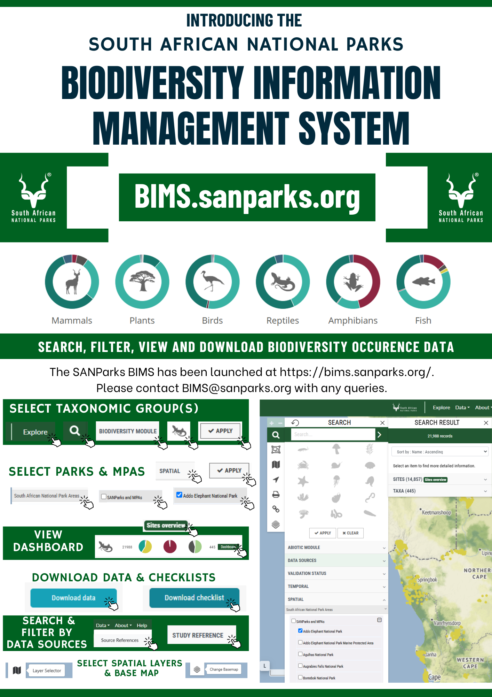

# Bims

The South African National Parks (SANParks) Biodiversity Information Management System (BIMS) was developed by tailoring the Freshwater Biodiversity Information System ([FBIS](https://freshwaterbiodiversity.org/)) to SANParks’ needs.

## What are sites? – An explanation of the term “site”

Sites are the geographical localities of occurrence records in latitude and longitude. Every occurrence record in the BIMS needs to be assigned to a coordinate, as that is the way the FBIS was created. Because of this, we have had to select artificial points to allocate occurrence data to when we only know that the taxon (genus, species, subspecies) occurs in a section or park. The artificial points have been called centroids but are not always located at the centre of a section or park.

## How to download a checklist

Go to the Explore tab, which shows the map, and Search by clicking on the magnifying glass icon. Select (FILTER) your taxonomic group(s) of interest in the Biodiversity module and click APPLY. Select your section, National Park or Marine Protected Area of interest in the Spatial FILTER and select APPLY. You will need to click SPATIAL and then click South African National Park Areas and click on the spatial layer you are interested in and then select the specific area and scroll down to click APPLY. After this, click on Site Overview and then Dashboard on the far right of the page. Once in the Dashboard, scroll down and click Download checklist to the left of the graphs.

## Disclaimer about the interpretation of checklists

Checklists provide a list of accepted scientific names with locality data for a national park, marine protected area or section of one of these. Checklists from the SANParks BIMS should not be accepted at face value. The information that is used to produce the checklists has not been vetted and it is likely to have some errors in it. For example, users of iNaturalist and Observation.org may have selected an incorrect scientific name for an animal they have seen. Different sources, particularly citizen science platforms, can use scientific names of different taxonomic rank (species and subspecies) when referring to the same taxon, which in this case, is an animal with the same common name. This is not a problem when one scientific name is a synonym of the other, as the issue will be resolved through the use of the Accepted name. It is a problem when both the subspecies and species names are accepted but they are being used to refer to the same taxon (same common name).

To finalise a checklist, the `incorrect` or redundant name can be removed and the source for the additional, redundant name can be shifted to the “correct” name. If you are unsure which name to use, then consider the sources and number of sources and occurrence records for the two names. Another rule of thumb that can be used, is where a common name refers to a species, then use the scientific name for the species name, as opposed to where a common name, such as blesbok, refers to a subspecies, where the scientific name for the subspecies should be used. The online version of Wilson and Reeder’s [Mammals of the World](https://www.departments.bucknell.edu/biology/resources/msw3/) provides a useful resource for information on mammals.

Another issue arises where the wrong subspecies has been named for a park e.g. confusing blue and black wildebeest or Mountain zebra and Burchell’s zebra. There shouldn’t be two subspecies co-occurring in a park, and where there are two subspecies, the one with the most sources and observations is likely to be correct. In all cases, the historical distribution range of one mammal subspecies will include the park, and that is the species that should be on the list.

Below are some examples of redundant and incorrect names that appear on mammal checklists from the SANParks BIMS.

| Incorrect Name                           | Correct Name                                     | Common Name       | Notes |
|------------------------------------------|------------------------------------------------|-----------------|----------------------------------------------------------|
| Antidorcas marsupialis marsupialis      | Antidorcas marsupialis (Zimmermann, 1780)      | Springbok       | Subspecies name only used on citizen science platforms |
| Caracal caracal caracal                 | Caracal caracal (Schreber, 1776)               | Caracal         | Subspecies name only used on citizen science platforms |
| Chlorocebus pygerythrus pygerythrus      | Chlorocebus pygerythrus (F.Cuvier, 1821)       | Vervet monkey   | Subspecies name only used on citizen science platforms |
| Connochaetes taurinus (Burchell, 1823)   | Connochaetes gnou (Zimmermann, 1780)           | Black wildebeest | One record of incorrect subspecies (Blue wildebeest) on citizen science platform. |
| Otocyon megalotis megalotis              | Otocyon megalotis (Desmarest, 1822)            | Bat-eared fox   | One record of subspecies on citizen science platform |
| Suricata suricatta suricatta             | Suricata suricatta (Schreber, 1776)            | Meerkat         | One record of subspecies on citizen science platform |
| Tragelaphus strepsiceros strepsiceros    | Tragelaphus strepsiceros (Pallas, 1766)        | Greater kudu    | Many records of subspecies on citizen science platforms |

[]
