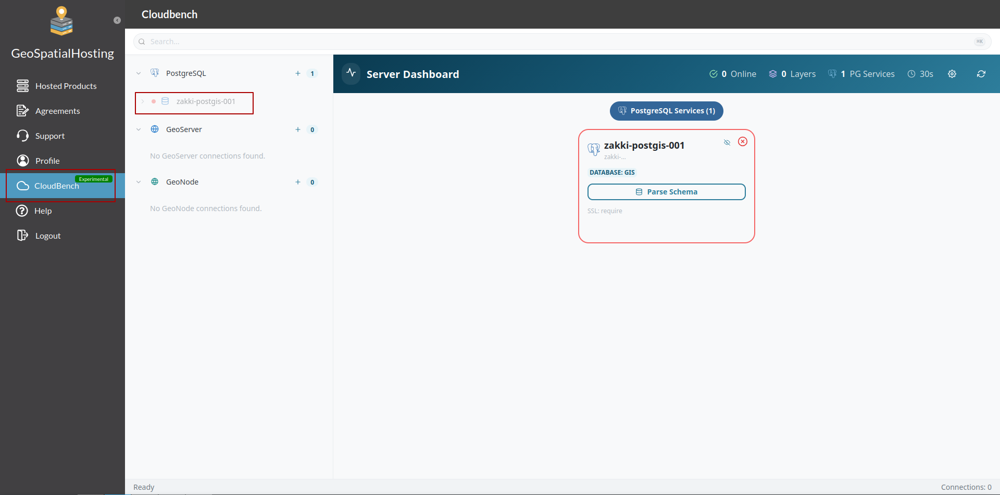

# CloudBench

## What is CloudBench?

**CloudBench** is a management dashboard that comes with your GeoHosting
account, giving you one place to work with data across your hosted
**GeoServer**, **GeoNode**, and **PostGIS** instances — without needing to
log in to each product separately or install any extra software.

You'll find it as its own page inside your GeoHosting dashboard, signed
in automatically with your GeoHosting account — there's nothing extra to
set up or log in to.

 

!!! note "Experimental"
    CloudBench is currently an early preview. It's already useful for
    day-to-day work, but it isn't yet covered by GeoHosting's customer
    Service Level Agreement (SLA). You may see this noted the first time
    you open it.

 

## Core Capabilities

- **GeoServer browser**

    Navigate your workspaces, data stores, coverage stores, layers,
    styles, and layer groups in one hierarchical tree, and edit layer
    metadata (title, abstract, keywords, attribution) directly.

- **Map preview**

    Preview layers on an interactive map (WMS/WMTS) before you use them
    elsewhere.

- **GeoWebCache management**

    Seed, reseed, and truncate cached tiles for your layers, with
    progress shown in real time.

- **Server synchronisation**

    Replicate resources — workspaces, stores, layers, styles — from one
    GeoServer instance to another.

- **PostgreSQL / PostGIS**

    Connect directly to your hosted database, browse schemas and tables,
    and run SQL queries.

- **File upload**

    Upload large geospatial files with progress tracking, rather than
    waiting on a single all-or-nothing transfer.

- **S3 storage**

    Browse and manage cloud-native geospatial data stored in S3.

- **QGIS & 3D**

    Manage and preview QGIS Server projects, and view supported data in
    an interactive 3D globe.

 

## Accessing CloudBench

1. Log in to your GeoHosting account as usual.
2. Open the **CloudBench** page from your dashboard.
3. The first time you open it, you'll see a short disclaimer about its
   experimental status — select **Continue** to proceed.

You'll only see the GeoServer, GeoNode, and PostGIS instances that belong
to your own GeoHosting account — CloudBench doesn't need any separate
setup to know which ones are yours.

  

 

## Getting Support

If you run into an issue or need assistance, the best place to start is
the **[Support Center](https://kartoza.github.io/GeoHosting-Documentation/users/support_center/)**
page in the **Users** section.

 
