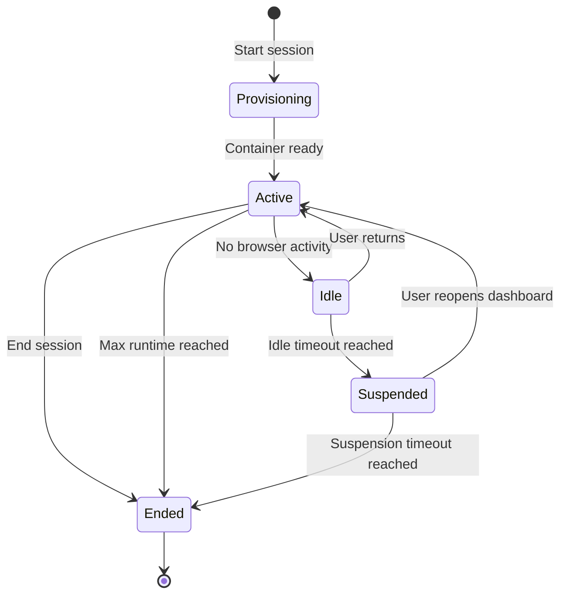

# Sessions

A **session** is one container running QGIS for one End User on one machine tier. This page describes the full session lifecycle, what affects it, and how to handle the rough edges.

## Lifecycle

| State | What it means | Billed? |
| --- | --- | --- |
| **Provisioning** | Container starting, home directory mounting. Typically 5–20 s. | No |
| **Active** | QGIS tab is open and you're using it. | Yes — at the tier's active rate |
| **Idle** | QGIS tab is open but no input for a short window. | Yes — at the tier's active rate |
| **Suspended** | Container kept warm but no active QGIS. Resumes instantly. | No |
| **Ended** | Container destroyed. Persistent home directory is intact; next session starts fresh container. | No |

 

## Idle and Max Runtime

Two timers apply to every active session:

- **Idle timeout** — runs when there's no browser activity (mouse, keyboard, scroll) in the QGIS tab. Default **30 minutes**. When it expires the session is suspended (not ended) — your work-in-progress in QGIS is preserved.
- **Max runtime** — runs from session start regardless of activity. Default **12 hours**. When it expires QGIS is given a clean shut-down signal, the project is auto-saved (if you have unsaved changes), and the session is ended.

The organisation administrator can adjust both per organisation. Defaults shown above.

 

## Starting a Session

From the End User dashboard click Open QGIS Desktop ↗. Behind the scenes:

1. The portal checks your organisation's machine-tier entitlement.
2. A container is scheduled on a host matching your tier.
3. Your persistent home directory is mounted at `/home/<you>/`.
4. QGIS starts inside the container.
5. The kasmVNC bridge opens; your browser tab connects.

First session of the day: 10–20 seconds. Subsequent sessions during the day: instant (the container is held warm during suspension).

 

## Ending a Session

Two ways:

- **Click End session on the dashboard.** Preferred. Gives QGIS a clean shutdown signal and frees the container immediately.
- **Walk away.** The idle timeout takes care of it. The session is suspended, then the suspension timeout (default 4 hours) ends it.

Always prefer the explicit end — billing stops sooner and the container slot is returned to the pool.

 

## What Happens to Open QGIS Work?

- **Saved files** (anything you've explicitly `File → Save`d to your home directory) are persisted.
- **Unsaved edits** are preserved while the session is in `Active`, `Idle`, or `Suspended` state. When the session is `Ended` they're lost — QGIS auto-saves a backup at `~/.cache/QGIS/QGIS3/backup/` on graceful shutdown (clicking End session or hitting the max-runtime limit). Hard kills do not generate a backup.
- **Open windows and layout** are preserved across suspend / resume cycles.

 

## Disconnects and Reconnects

If your network drops, the QGIS tab will show a reconnect indicator. The session itself keeps running — kasmVNC reconnects automatically when the network returns, usually within a few seconds.

If you close the tab without ending the session:

1. The session enters `Idle` immediately (no input).
2. After the idle timeout it suspends.
3. If you reopen the dashboard within the suspension timeout the session resumes — same windows, same projects.

 

## Limits per Organisation

The Organisation administrator sets:

- **Concurrent active sessions per user** — usually 1.
- **Concurrent active sessions per organisation** — typically the number of seats in the subscription.

If you try to start a second concurrent session while at the limit you'll see a clear error explaining which limit is hit and how to free a slot.

 

## See Also

- [Storage](storage.md) — what survives session end.
- [Machine tiers](machine-tiers.md) — what differs between tiers.
- [Quickstart](../guide/quickstart.md) — the happy-path tutorial.
