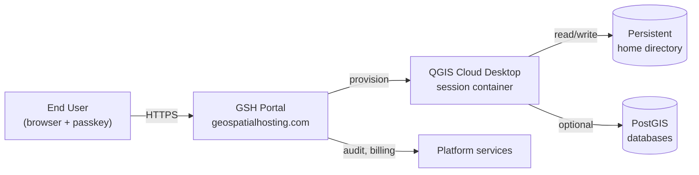

# QGIS Cloud Desktop Overview

## Why Choose This Product?

**QGIS Cloud Desktop** is a hosted, full QGIS workstation that runs in the browser. It is for teams that need everyone working on the same data, with the same QGIS plugins and the same project files, without the per-machine setup tax.

The session you launch today is the same session you'll see tomorrow. Your home directory, plugin choices, project files, layer styles, and even the windows you left open all persist between sign-ins. Kartoza provisions the machine, keeps QGIS patched, and gets out of your way.

- **Your QGIS, exactly as you left it.**

    Persistent home directories survive session end. Open `~/Projects/my-survey.qgs` today, close the tab, sign in from a different laptop tomorrow — the project is still there, your layer order is preserved, your unsaved edits are still on disk. No "where did I save that?" moment.

     

- **Right-sized machines per workload.**

    Pick a machine tier that fits the job: a light tier for training and small projects, a workstation tier for analytical work over millions of features, a heavy tier for raster processing or running models. Switch tiers between sessions — the home directory is the same, only the compute changes.

     

- **Passkey-only sign-in. No passwords.**

    Every End User signs in with a passkey (FIDO2 / WebAuthn) — biometric on the device, hardware security key, or platform authenticator. Passwords are not used and not even available as a fallback. Phishing-resistant by design, audited per sign-in.

     

- **Organisations, not individuals.**

    QGIS Cloud Desktop is sold to an organisation. The organisation administrator invites teammates as End Users, assigns machine tiers, sets per-user storage quotas, and removes leavers. Each End User has an isolated home directory; the organisation pays one consolidated bill.

     

- **Open everything.**

    QGIS itself is open source. The GSH platform that runs QGIS Cloud Desktop is open source (AGPL). The container that hosts your session is built reproducibly from a nix flake. There is nothing proprietary you have to take on trust.

     

## How It Fits Together

When you sign in:

1. You authenticate to the GSH Portal with your passkey.
2. The portal verifies your organisation membership and machine tier entitlement.
3. A session container is started on a machine matching your tier.
4. Your persistent home directory is mounted into the container at `/home/<you>/`.
5. The portal streams the desktop to your browser via kasmVNC.

When you close the tab the session continues running for a short idle window, then gracefully suspends. Re-opening the portal resumes the same session — same windows, same projects, same cursor position.

 

## Personas

| Persona | What they do | Where to start |
| --- | --- | --- |
| **End User** — analyst, surveyor, student | Sign in, work in QGIS, save to the home directory, end the session. | [Quickstart guide](guide/quickstart.md) |
| **Organisation Administrator** | Invite teammates, assign tiers, manage quotas, remove users when they leave. | [Managing users & permissions](guide/permissions.md) |
| **Billing contact** | Review monthly usage, manage payment method, download invoices. | [GSH Dashboard guide](../../users/dashboard.md) |

 

## What's New

- Hosted on Kartoza's EU and Africa regions.
- Passkey enrolment is enforced — passwords are not used.
- Persistent home directories survive session end and machine-tier switches.
- Machine tier billing is per-second of active session time, not per-day flat rates.

 

Next: [Creating Your Instance →](guide/create_instance.md)
