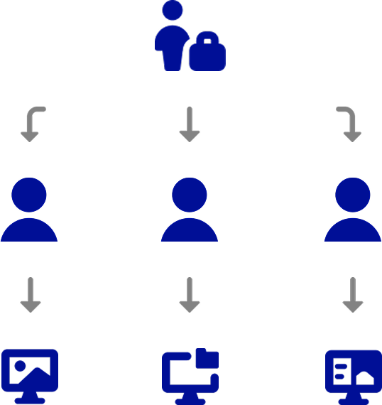

# QGIS Cloud Desktop

## What is QGIS Cloud Desktop?

**QGIS Cloud Desktop** provides a complete Linux desktop environment running in the cloud and accessible directly through your web browser.

Instead of installing and maintaining QGIS and other GIS software on every computer, users can launch their own cloud-based desktop session whenever they need it. The desktop includes QGIS and can also provide access to other applications and tools required for geospatial workflows.

Each user's desktop has a **persistent home folder**, allowing files and settings to remain available between sessions. Organisations can also connect users to PostgreSQL/PostGIS databases, making it possible to work with centrally managed spatial data directly from QGIS.

 

  

 

## Key Capabilities

- **Full QGIS Desktop in the Browser**

    Run QGIS Desktop in the cloud without installing it locally. Access your desktop through a web browser.

- **Persistent User Storage**

    Store projects, datasets, scripts, settings, and other files in a persistent home folder that remains available between sessions.

- **Cloud-Based Computing**

    Run GIS processing and other workloads on cloud infrastructure instead of relying entirely on your local computer.

- **PostgreSQL & PostGIS Integration**

    Connect QGIS Cloud Desktop to PostgreSQL/PostGIS databases with automatically configured connection settings.

- **Multiple Users**

    Organisations can create multiple End Users and provide each person with their own QGIS Cloud Desktop environment.

- **Flexible Machine Sizes**

    Choose an appropriate machine tier for each user based on the computing resources required for their GIS workflows.

- **Browser-Based Access**

    Access your cloud desktop from a modern web browser without needing to install a remote desktop client.

- **Pre-configured GIS Environments**

    Select from available desktop images to provide users with an environment configured for specific workflows.

 

## How QGIS Cloud Desktop Works

QGIS Cloud Desktop separates the management of users and cloud resources from the desktop environment itself.

An **Organisation Owner** manages users and access through the GeoSpatialHosting dashboard. They can create End Users, assign QGIS Cloud Desktop access, select the machine size and storage capacity, and provide access to registered PostgreSQL databases.

An **End User** then signs in to the QGIS Cloud Desktop Portal, launches a desktop session, and opens their cloud-based Linux desktop in their browser.

 

  

 

## Typical Workflows

QGIS Cloud Desktop can support a range of GIS workflows, including:

- Creating and editing QGIS projects
- Processing and analysing spatial data
- Working with PostgreSQL/PostGIS datasets
- Running GIS scripts and other desktop applications
- Using specialised pre-configured GIS environments

 

The service is particularly useful when users need a consistent GIS environment that can be centrally managed and accessed from different computers.

 

## Getting Started & Resources

If you are an **Organisation Owner**, start by creating an End User and granting them access to QGIS Cloud Desktop.

If you are an **End User**, your organisation will provide you with an enrolment link and access to the QGIS Cloud Desktop Portal.

 

Use the guides and resources below to get started:

  

    

      🚀 <a href="./guide/create_instance/">Creating Your Instance</a>
    

    

      Set up a QGIS Cloud Desktop environment and configure its resources.
    

  

  

    

      🔐 <a href="./guide/first_login/">First Log In & Setting Your Password</a>
    

    

      Register your access, sign in, and prepare your first cloud desktop session.
    

  

  

    

      🗺️ <a href="./guide/quickstart/">Quickstart: 5-Minute Tutorial</a>
    

    

      Launch your first QGIS Cloud Desktop session and start working in QGIS.
    

  

  

    

      🎫 <a href="https://geospatialhosting.com/#/dashboard/support">Create a Support Ticket</a>
    

    

      Create a support ticket from the GeoSpatialHosting dashboard.
    

  

 
