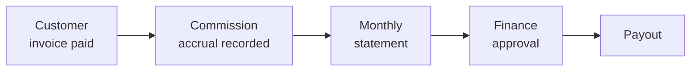

# Commissions, Payouts & Statements

This page explains how earnings flow from a paying customer through to money in your bank account: what counts as an accrual, how stacking is handled, the monthly statement, and the payout cycle.

## The Earnings Lifecycle

| Step | When it happens |
| --- | --- |
| **Invoice paid** | Customer's payment is successfully captured. |
| **Accrual recorded** | Next overnight batch (typically within 24 h of payment). |
| **Statement generated** | 3rd of each month, for the prior month. |
| **Finance approval** | Within 5 business days of statement generation. |
| **Payout** | 15th of each month (or next business day). |

 

## What Triggers an Accrual

Each GSH product has its own commission rules, but the general pattern:

| Source event | Accrual rule |
| --- | --- |
| **Recurring subscription invoice** | A % of the invoice amount, paid every month the subscription stays active. |
| **One-off product purchase** | A % of the one-off price. |
| **Training course seat sold** | A flat per-seat fee share (Trainers only). |
| **Training delivery completed** | Per-attendee fee share, on Kartoza-listed courses you led (Trainers only). |

The exact percentages and flat fees are listed per product in your dashboard under Profile → Commission rates. Rates are reviewed annually; if a change is upcoming you're notified 30 days in advance and existing customers grandfather on the old rate for 12 months.

 

## Stacking Rules

When a customer subscribes to multiple products from the same partner, accruals from each product are recorded independently. There is no stacking penalty.

When a customer was first attributed to **partner A** via a referral code, then later signed up to a second product after seeing **partner B's** widget, the second product's accrual goes to partner B. The cookie + code precedence is per-product, not per-customer.

 

## Currency Handling

Customers are billed in their local currency. Your accruals are recorded in the customer's billing currency and converted to your **payout currency** (set in Profile → Tax & bank) on the **statement-generation date** using a daily-snapshot FX rate.

You can choose to receive payouts in any of: EUR, USD, GBP, ZAR.

Currency conversion fees are absorbed by the platform — you receive the converted amount as shown on the statement.

 

## Statements

Generated on the **3rd of each month** for the prior month's earnings. Each statement contains:

- A per-customer per-product accrual table.
- Any reversals (see [Clawbacks](#clawbacks)).
- A total payable in your payout currency.
- Tax / VAT line if applicable (the statement is the basis for the self-billing invoice — see below).

You receive an email when a new statement is published. The statement PDF stays in your dashboard indefinitely.

 

### Self-Billing Invoices

For VAT-registered partners in the EU and UK, the platform generates a **self-billing invoice** alongside the statement. This is a legally-recognised invoice prepared by Kartoza on your behalf — you don't need to send us a separate invoice for the same amount.

The self-billing arrangement is set up when you provide your VAT number during application. You can revoke it from Profile → Tax & bank.

 

## Payouts

After a statement passes Finance approval, the payout is initiated to your registered payout method. Default cycle: the **15th of each month**, or the next business day if the 15th is a weekend or holiday.

Supported payout methods per region:

| Region | Methods |
| --- | --- |
| EU | SEPA bank transfer (preferred), bank wire. |
| UK | Faster Payments bank transfer, bank wire. |
| US | ACH, bank wire. |
| Other | Bank wire (may incur receiving-bank fees). |

Minimum payout threshold: **€50** (or local-currency equivalent). Below the threshold the payout rolls over to the next month and accumulates.

 

## Clawbacks

Some events reverse a previously-recorded accrual:

- **Refund / chargeback** — the underlying invoice is refunded. The associated accrual is reversed in the next overnight batch.
- **Subscription cancelled within trial** — if the customer cancels before the first full billing period, the trial-period accrual (if any) is reversed.
- **Fraudulent signup** — if the platform identifies a fraudulent signup (synthetic identity, stolen card), the related accruals are reversed.

Reversals show on the next statement as a negative line with a reference back to the original accrual.

 

## Disputes

If you believe an accrual or reversal is wrong:

1. Open the row in Earnings.
2. Click Dispute.
3. Provide a short reason and any evidence.

Programme Manager reviews within 5 business days. The outcome is recorded against the accrual and visible to both you and Kartoza Finance.

 

## See Also

- [Partner Dashboard](dashboard.md) — where to view all of the above.
- [Referrals & Attribution](referrals.md) — how a customer gets attributed in the first place.
- [Code of Conduct](code-of-conduct.md) — enforcement actions that can pause accruals.
