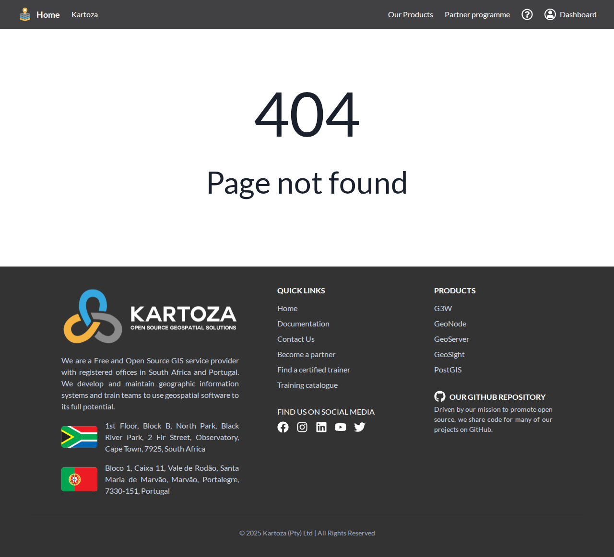

# Training Delivery

For **Certified Trainers** only. If you're a Reseller-tier partner, you can skip this page (or apply for trainer certification — see [Applying](applying.md)).

## Certification Components

Trainer certification is **per component**, not per trainer. A component is a specific subject — for example:

- "QGIS Cloud Desktop fundamentals"
- "PostGIS data modelling"
- "GeoServer publishing for newsrooms"
- "Spatial SQL for analysts"

You apply per component, are reviewed per component, and are approved (or asked for more evidence) per component. The list of components is on your dashboard at Training → Components.

  

A component is one of:

| Status | What it means |
| --- | --- |
| **Approved** | You can deliver training and issue certifications for this component. |
| **In review** | Programme Manager is evaluating your submission. |
| **More info needed** | You've been asked for additional evidence. |
| **Declined** | We're not certifying you for this component (specific reason in the row). |
| **Fast-tracked** | Approved via the fast-track path (you completed Kartoza's "QGIS for trainers" course). |

 

## Delivering Training

When you deliver a training session, record it in the dashboard so attendee certifications are issued and seat-fee accruals are recorded:

1. From Training → Sessions click New session.
2. Choose the **component** you delivered.
3. Add the date, duration, and a one-line description of cohort and venue.
4. Add attendees by email. The platform sends each attendee a certification email if they accept.

Per-seat fees accrue when attendees accept their certification. Reversals apply if they later decline or report the training was not delivered as described.

 

## Co-Marketed Cohorts

A **co-marketed cohort** is a training run that Kartoza announces alongside its own listings on geospatialhosting.com — so prospective customers see your cohort with the same visual weight as Kartoza-led runs.

### Proposing a Cohort

From Cohorts → Open click Propose cohort:

- **Course** — must be a component you're approved for.
- **Proposed start / end dates.**
- **Audience description** — who the cohort is for, language, region, prior experience expected.
- **Requested revenue share** — the per-seat split you're proposing for this cohort. Defaults to your standard component rate but can be negotiated up or down per cohort.

Programme Manager reviews. Outcomes:

- **Approved** — Kartoza lists the cohort and you start marketing. The agreed revenue share applies for all seats sold via the platform.
- **Rejected** — with a reason. You can re-propose with revised terms.
- **Withdrawn** — you withdrew the proposal before review.

 

### What Kartoza Provides

For an approved co-marketed cohort:

- Listing on the public courses catalogue at `geospatialhosting.com/#/courses`.
- A dedicated cohort page with your branding alongside Kartoza's.
- Email blast to the GSH customer base (one per cohort, around 7 days before start).
- Optional inclusion in the monthly Kartoza newsletter.
- Handling of seat sales, refunds, and certification issuance through the same flow as Kartoza-led courses.

You retain ownership of the cohort — pricing, schedule, delivery format, and the actual instruction are entirely yours.

 

## Bundles

Some Kartoza-listed courses include a **GSH cloud credit** as a bundle — e.g. "QGIS certification + €100 GSH credit". When a customer buys a bundle:

- The seat-fee accrual is recorded normally.
- The cloud credit is applied to the customer's GSH account by the operator team.
- The bundle line is shown on the customer-facing course page with a green "+ €100 GSH credit" badge.

Bundle terms are configured by Kartoza per course. Trainers don't set bundle credits themselves.

 

## Earnings From Training

Two flavours of accrual:

| Event | Accrual |
| --- | --- |
| **Seat sold** | The per-seat fee share at the time of sale (or the cohort-specific share for a co-marketed cohort). |
| **Cohort delivery completed** | A delivery bonus if configured for the course. |

All training accruals appear on the same monthly statement as your product commissions — see [Commissions](commissions.md).

 

## See Also

- [Applying](applying.md) — adding the Trainer tier to your account.
- [Commissions](commissions.md) — how training accruals roll into the statement.
- [Partner Dashboard](dashboard.md) — overview of all training panels.
