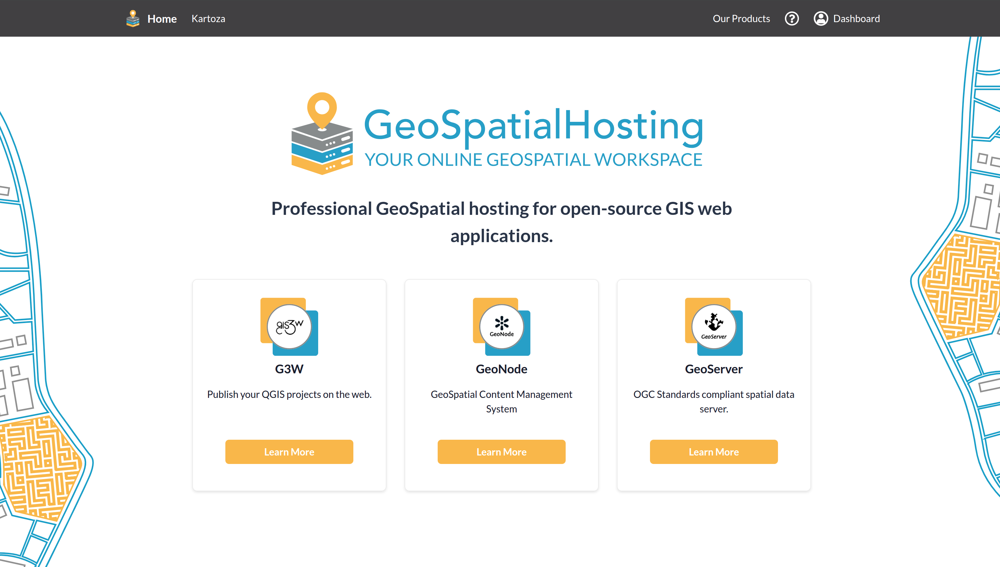

# Users

Your guide to using the Kartoza GeoSpatialHosting (GSH) platform. From learning your way around the dashboard to logging support tickets, this section walks you through the features, workflows, and resources you need to get the most out of GSH.

 

  

 

  
🌐 GSH Dashboard

  

    Learn how to navigate the GeoSpatialHosting dashboard — manage your projects, monitor activity, and access platform tools from one central location.
  

  

    <a href="dashboard/">Go to Dashboard Guide →</a>
  

  
🛠️ Support Center

  

    Need help? Log a support ticket, track your requests, and browse solutions in our Support Center to get the assistance you need quickly.
  

  

    <a href="support_center/">Go to Support Center Guide →</a>
  

  
🤝 Affiliate Programme

  

    Resell GSH products, deliver Kartoza-certified training, and earn recurring commission. Application, partner dashboard, referrals, payouts, and Code of Conduct — everything you need to partner with Kartoza.
  

  

    <a href="affiliate-programme/">Open the Affiliate Programme →</a>
  

 
